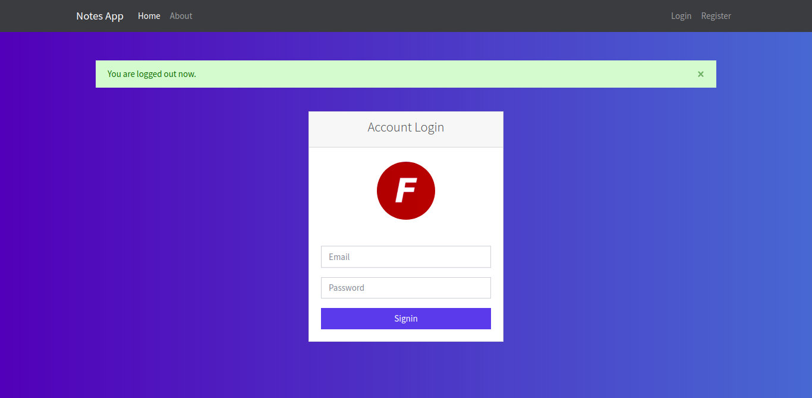
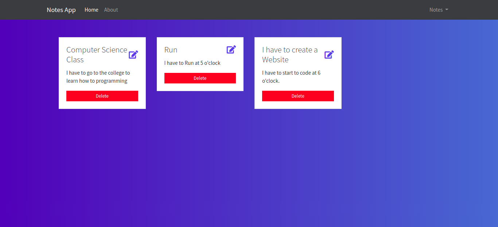

# Notes App with Node, Mongodb by [FAZT](https://www.faztweb.com/)

This is a basic App to manage simple Notes on the web using Javascript Technologies like Nodejs, Mongodb, and so on.
This app can:

- create/read/update/delete Notes
- Allows a user to do log in and save his personal notes

## Screenshot





## This example has been created following the amazing video tutorial by Fazt [LINK](https://www.youtube.com/watch?time_continue=12&v=-bI0diefasA)

## INSTALL & DEVELOP

```bash
npm install
npm run dev
```

### Init MongoDB - localhost

- On Windows: `mongod`
- ON Linux: `sudo service mongod start`
- Start connection with the database: `mongo`
